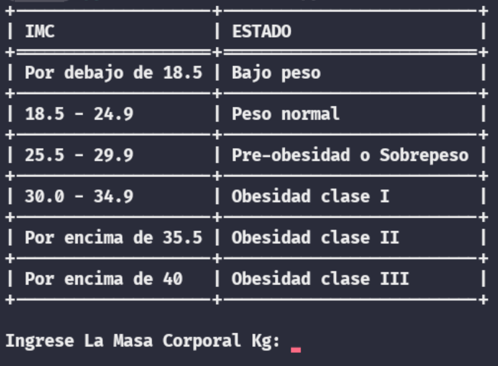

<h1 align="center">Calculadora_IMC</h1>

 Calcula la estatura y el peso, da como resultado tu IMC

 

## Actualizamos los paquetes
    apt update && apt upgrade -y

## Instalamos git
    pkg install git  
## Instalamos python3
    pkg install python3
## Instalamos la librería tabulate
    pip install tabulate
## Clonamos el repositorio
    git clone https://github.com/STE4LPH/Calculator_IMC.git
## Navega al directorio:
    cd Calculator_IMC    
## Ejecutar el script:
    python calculador_imc.py
